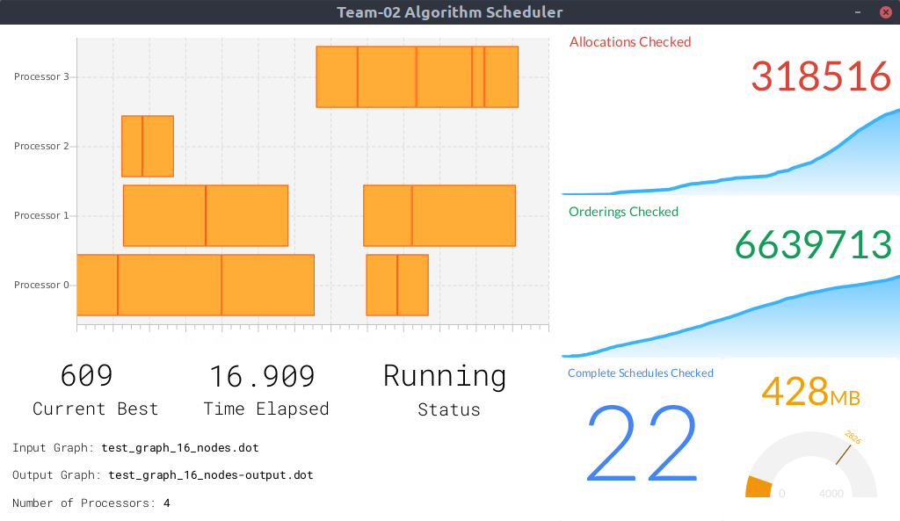

SOFTENG 306 Project 1
=====================

[](https://circleci.com/gh/timovv/306)


This project aims to develop a fast algorithm to solve optimal task scheduling on multiple processors. We have implemented three different algorithms, DFS branch-and-bound, A* and a parallel version of DFS branch-and-bound. A* is typically used, but DFSBnB is used for visualisation, whereas parallel DFSBnB is used when multiple processors are specified by the user. These algorithms all run on a allocation-ordering (AO) search space. To find schedules, tasks are first allocated to a processor. Then, the tasks on each processor are ordered to form a valid schedule.

The Team
--------

We are Team-02 (also known as Team 2).

| Name                | UPI     | Github Username                               |
| ------------------- | ------- | --------------------------------------------- |
| Liam Caldwell       | lcal259 | [ljcnz](https://github.com/ljcnz)             |
| Nisarag Bhatt       | nbha702 | [FocalChord](https://github.com/FocalChord)   |
| Timo van Veenendaal | tvan508 | [timovv](https://github.com/timovv)           |
| Tony Liu            | tliu818 | [Minus20Five](https://github.com/Minus20Five) |
| William Li          | wli213  | [williamlixu](https://github.com/williamlixu) |
| William Li          | zli667  | [TwelveHertz](https://github.com/TwelveHertz) |


Project Setup
-------------

1. Clone the repo: 
``` 
https://github.com/timovv/306.git
```

2. Import as Gradle project in Intellij (preferably enable auto-import)
3. Install Lombok Intellij plugin 
4. Run the following Gradle task: 
```
./gradlew generateGrammarSource
```
Or, just run `./gradlew assemble`

Building
--------

To build an executable jar, run

```
./gradlew clean shadowJar
```

The jar will be placed in `build/libs/`.

Usage
-----

To execute, just run `java -jar <jarname.jar> [options...]`

The appliation accepts a number of command-line parameters.

```
Usage: java -jar <project.jar> INPUT.dot P [OPTIONS]
 
INPUT.dot (A task graph with integer weights in dot format) 
P (Number of processors to schedule the INPUT graph on.) 

Optional: 
-p N (Use N cores for execution in parallel (default is sequential).) 
-v (Visualise the search.) 
-o OUTPUT (Output file is named OUTPUT (default is INPUT-output.dot).)
```

Visualisation
--------------------

Running the program with the `-v` flag enables the visualisation. The visulisation shows useful statistics as the algorithm is running, such as the number of allocations and orderings checked and the best schedule found so far.


Useful Documentation
--------------------

* [Meeting Minutes](https://github.com/timovv/306/wiki/Meeting-Minutes)
* [Project Plan](https://github.com/timovv/306/wiki/Project-Plan)
* [Architecture design document](https://github.com/timovv/306/wiki/Architecture)
* [Algorithm ideas](https://github.com/timovv/306/wiki/Algorithms:-ideas-and-approaches)
